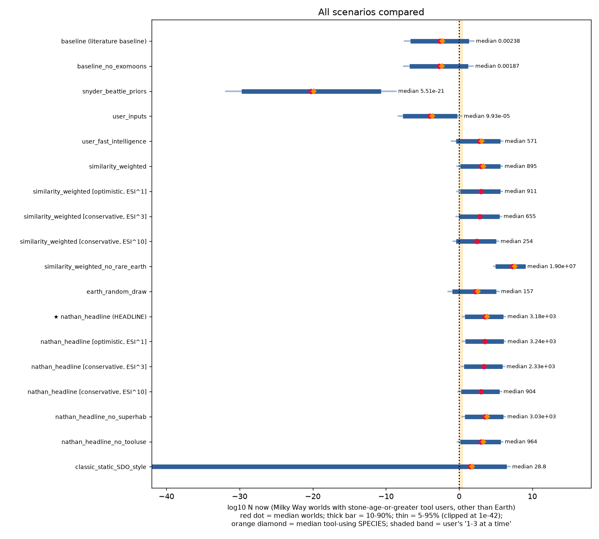

# Time-aware extended Drake equation: simultaneous stone-age-or-greater civilizations in the Milky Way

*Model by Nathan A. Meeks.* A Monte Carlo, time-resolved Drake model that counts how many worlds in the Milky Way have stone-tool-using (or more advanced) life **at the same time as us**.

## Headline

| | Nathan's headline (`nathan_headline`) | Literature baseline (`baseline`) |
|---|---|---|
| **Median (50/50) worlds now, other than Earth** | **3.18e+03** | **0.00238** |
| 10th–90th percentile | 12.8 – 5.53e+05 | 4.27e-07 – 10.4 |
| Mean | 9.55e+05 | 4.31e+03 |
| P(N < 1) | 0.030 | 0.820 |
| Median tool-using species now | 7.13e+03 | 0.00534 |
| Median worlds that ever had tool users (by now) | 5.06e+04 | 0.851 |
| Median nearest-neighbour distance at the median N | 744 ly | 8.53e+05 ly (N<1: no neighbour expected) |
| Equal-cube side at the median N (disk ≈ 7.9e12 ly³) | 1.35e+03 ly | 1.49e+05 ly |



Headline histogram: [`results/hist_log10N.png`](results/hist_log10N.png) · sensitivity tornado: [`results/tornado.png`](results/tornado.png) · literature baseline: [`hist`](results/hist_log10N_baseline.png), [`tornado`](results/tornado_baseline.png)

## Method

**Target.** Worlds hosting a lineage that habitually makes stone tools (Lomekwi/Oldowan level) or anything more advanced, alive *now*. Radio detectability does not enter: it changes what we can detect, not N.

1. **Star formation history of the disk.** A thick-disk phase 13.0–8.5 Gyr ago (≈ half the disk mass), then an exponential thin disk normalised to today's SFR and disk mass. This replaces a constant R\*.
2. **Habitable bodies per star**, split into G/K and M hosts:
   * η⊕ from Kepler/Archive studies.
   * Rare-Earth multipliers: plate tectonics, land + ocean, large moon, Jupiter shield, binary stability, M-dwarf flares and tidal/water loss.
   * Galactic habitable zone and a metallicity ramp in time.
   * Habitable exomoons around HZ giants.
3. **Biology as hard steps:** abiogenesis → oxygenic photosynthesis → eukaryotes → complex multicellularity → stone-tool intelligence. Each step is an exponential waiting time, and their convolution competes with the host's habitable window.
4. **Duration and recurrence.** A tool-using phase ends through intrinsic lifetime, Big-Five-class extinctions, GRBs/supernovae and self-inflicted risk. It can re-evolve afterwards (an alternating renewal process). Whole-biosphere sterilisation scales with past star formation.
5. **Output.** N(t) on a 20-Myr grid over 13.8 Gyr. Reported: N now, time-averaged N, N_ever, and species = worlds × hominin-like species per tool world.

**Nathan's headline (`nathan_headline`).**
* **Similarity weighting.** Known Earth-like planets are treated as sharing Earth's evolutionary timeline as the *typical* case (each step's expected time equals Earth's observed interval), weighted by the Earth Similarity Index (Schulze-Makuch et al. 2011, ESI¹) of the NASA Exoplanet Archive's HZ rocky planets.
* **Superhabitability boost.** A boost of 1–3× (ASSUMED) applies to the fraction of G/K planets meeting the Schulze-Makuch, Heller & Guinan 2020 criteria.
* **Cross-lineage tool use.** Tool use evolved independently many times on Earth (primates, corvids, octopus, sea otters, dolphins, elephants). The animals → tools step is therefore modelled as fast and repeatable: Earth's 0.597-Gyr interval is divided by 3–7 independent origins.

**Literature baseline (`baseline`).** Hard-step expected times are log-uniform over 1e-3–1e3 Gyr, then updated on Earth's dated fossil record with the observer-selection correction of Snyder-Beattie et al. 2021, which favours slow, rare steps. **The choice between these two framings explains most of the ~6-orders-of-magnitude gap between the two headline numbers.**

**Archive inputs** (pscomppars, pulled 1 Oct 2026: 6,375 confirmed planets):
* HZ rocky planets (R < 1.8 R⊕): 23 conservative and 37 optimistic, or 26 and 41 including TRAPPIST-1 with Teff clamped to 2600 K.
* Mean ESI: 0.849 (conservative) and 0.865 (optimistic).
* Top ESI: Teegarden's Star b 0.979, TOI-700 d 0.942, Kepler-1649 c 0.940, GJ 3378 b 0.938, TOI-700 e 0.932, GJ 1002 b 0.926.
* No confirmed Archive planet meets the superhabitable criteria (K host, 1.0–1.5 R⊕, 282–302 K assumed surface temperature). The closest is Kepler-62 f (K host, 1.41 R⊕, 7 Gyr; too cold under the assumed temperature).

## Variables and sources

Every variable lives in [`params.yaml`](params.yaml). `best` is the value used in the deterministic point estimate; the default is the geometric mean for log-uniform and the midpoint for uniform.

| variable | distribution / range | best | meaning | source |
|---|---|---|---|---|
| `sfr_now` | normal 1.65 ± 0.19 | default | Msun/yr | Licquia & Newman 2015, ApJ 806, 96 — https://arxiv.org/abs/1407.1078 |
| `m_disk_now` | normal 5.17e10 ± 1.11e10 | default | Msun (disk stellar mass today) | Licquia & Newman 2015 — https://arxiv.org/abs/1407.1078 |
| `return_fraction` | uniform [0.27, 0.41] | default | - | Madau & Dickinson 2014 ARA&A (R=0.27 Salpeter, 0.41 Chabrier) — https://ned.ipac.caltech.edu/level5/March14/Madau/paper.pdf |
| `f_early_disk_mass` | uniform [0.4, 0.6] | default | fraction of disk mass formed 13.0-8.5 Gyr ago (thick-disk phase) | Snaith et al. 2015 A&A 578, A87 ('roughly half the stellar mass in first 4-5 Gyr') — https://www.aanda.org/articles/aa/full_html/2015/06/aa24281-14/aa24281-14.html |
| `disk_start_gyr` | fixed 0.8 | default | Gyr after Big Bang (13.0 Gyr ago) | Snaith et al. 2015 (thick disk 9-13 Gyr ago) — https://www.aanda.org/articles/aa/full_html/2015/06/aa24281-14/aa24281-14.html |
| `thick_end_gyr` | fixed 5.3 | default | Gyr after Big Bang (8.5 Gyr ago) | Snaith et al. 2015 (sharp SFR drop ~8-9 Gyr ago) — https://www.aanda.org/articles/aa/full_html/2015/06/aa24281-14/aa24281-14.html |
| `stars_per_msun` | uniform [1.6, 2.8] | 1.64 | stars per Msun formed | Kroupa 2001 IMF: 1.64 H-burning stars/Msun (integrated here); 2.8 = 1/0.36 incl. brown dwarfs — https://adsabs.harvard.edu/pdf/2001mnras.322..231k |
| `f_gk` | uniform [0.1, 0.17] | default | fraction of stars that are G/K | RECONS 10-pc census (G 5.0% + K 11.6%); Kroupa IMF 0.6-1.1 Msun = 10% — http://www.recons.org/census.posted.htm |
| `f_m` | uniform [0.75, 0.81] | default | fraction of stars that are M dwarfs | RECONS 10-pc census (75%); Kroupa IMF 0.08-0.6 Msun = 81% — http://www.recons.org/census.posted.htm |
| `fp` | fixed 1.0 | default | - | Cassan et al. 2012 Nature 481, 167 (>=1 bound planet per star) — https://www.nature.com/articles/nature10684 |
| `ne_gk` | loguniform [0.1, 0.88] | 0.35 | rocky HZ planets per G/K star (fp folded in) | Bryson+2021 AJ 161, 36 (G-mid-K: 0.37-0.60 conservative, 0.58-0.88 optimistic); 2026 Astronomy & Computing reanalysis of 4,510 Archive transit planets: K ~0.27, F/G ~0.10 (schematic). best = K-weighted (K:G ~2:1 by number, RECONS) — https://arxiv.org/abs/2010.14812 ; https://astrobiology.com/2026/08/06/quantifying-detection-bias-and-recovering-habitable-zone-occurrence-rates-in-the-nasa-exoplanet-archive/ |
| `ne_m` | loguniform [0.16, 0.41] | 0.24 | Earth-size HZ planets per M dwarf (before the M-dwarf habitability penalties) | Dressing & Charbonneau 2015 ApJ 807, 45 (0.16 conservative, 0.24 broad HZ); 2026 Astronomy & Computing Archive reanalysis (M ~0.41, completeness-corrected; raw 4.03%) — https://arxiv.org/abs/1501.01623 ; https://astrobiology.com/2026/08/06/quantifying-detection-bias-and-recovering-habitable-zone-occurrence-rates-in-the-nasa-exoplanet-archive/ |
| `f_m_habitable` | loguniform [0.03, 1.0] | default | M-dwarf penalty for tidal locking + pre-main-sequence water loss (flares are separate, see multipliers.f_m_flares) | ASSUMED bracket informed by Shields+2016 Phys.Rep.; Luger & Barnes 2015; Lingam & Loeb 2018 JCAP; Haqq-Misra+2018 IJA; Snyder-Beattie+2021 prediction — https://arxiv.org/abs/1610.05765 |
| `th_gk_gyr` | loguniform [5.0, 20.0] | 7.0 | Gyr habitable window for complex life (G/K) | Rushby et al. 2013 Astrobiology (Earth HZ lifetime 6.29-7.79 Gyr; K dwarfs longer); Earth biosphere ends 0.8-1.5 Ga from now (Caldeira & Kasting 1992 via Snyder-Beattie+2021) — https://research-repository.st-andrews.ac.uk/handle/10023/5071 |
| `th_m_gyr` | loguniform [10.0, 50.0] | 20.0 | Gyr habitable window (M dwarfs) | Rushby et al. 2013 (HZ lifetimes up to 54.7 Gyr) — https://research-repository.st-andrews.ac.uk/handle/10023/5071 |
| `f_ghz` | loguniform [0.1, 1.0] | default | spatial fraction of disk stars in Galactic Habitable Zone | Lineweaver, Fenner & Gibson 2004 Science (<10% incl. time/metallicity cuts); Prantzos 2008 SSRv (whole disk by now); Gowanlock+2011 (1.2% incl. more factors) — https://arxiv.org/abs/astro-ph/0401024 |
| `t_metal_gyr` | uniform [1.0, 3.0] | default | Gyr after Big Bang when Earth-forming metallicity is reached (logistic midpoint, width 0.5 Gyr) | ASSUMED; informed by Lineweaver 2001 Icarus (metallicity selection; Earths avg 1.8+/-0.9 Gyr older than Earth) and Zackrisson+2016 ApJ 833, 214 — https://ui.adsabs.harvard.edu/abs/2001Icar..151..307L/abstract |
| `n_giant_hz_gk` | uniform [0.065, 0.115] | default | giant planets (3-25 R_earth) in optimistic HZ per G/K star | Hill et al. 2018 ApJ 860, 6 (G 6.5+/-1.9%, K 11.5+/-3.1%) — https://arxiv.org/abs/1805.03370 |
| `n_giant_hz_m` | loguniform [0.01, 0.12] | 0.06 | giant planets in optimistic HZ per M dwarf | Hill et al. 2018 (M 6+/-6%); lower bound 0.01 ASSUMED — https://arxiv.org/abs/1805.03370 |
| `f_exomoon_host` | loguniform [0.0001, 1.0] | default | fraction of HZ giants hosting a >~0.1-0.3 M_earth (atmosphere-retaining) moon | WIDE ASSUMED prior. Low end: Canup & Ward 2006 Nature (satellite systems ~1e-4 of planet mass -> in-situ moons Moon-to-Mars size); capture routes Williams 2013 Astrobiology, Porter & Grundy 2011 ApJL (~half of captured orbits circularise); Kepler-1625b-i (Teachey & Kipping 2018) and Kepler-1708b-i (Kipping+2022) candidates contested (Heller+2023, arXiv:2312.03786). High end: Hill+2018 'one large moon per giant' case — https://www.nature.com/articles/nature04860 |
| `f_exomoon_habitable` | loguniform [0.1, 1.0] | default | fraction of such moons outside the tidal/illumination 'habitable edge' | ASSUMED range; Heller & Barnes 2013 Astrobiology 13, 18 (habitable edge; tidal heating can sterilise); Williams, Kasting & Wade 1997 Nature 385, 234 (habitable moons concept) — https://arxiv.org/abs/1209.5323 |
| `r_ster0_per_gyr` | loguniform [0.001, 0.25] | default | per Gyr, whole-biosphere sterilisation rate today (scaled by SFR(t)/SFR_now in the past) | ASSUMED; upper bound: Earth's biosphere unsterilised for ~4 Gyr; SFR scaling motivated by Piran & Jimenez 2014 PRL (GRB hazard higher in early Universe) — https://arxiv.org/abs/1409.2506 |
| `r_bigfive_per_gyr` | uniform [9.3, 10.6] | default | per Gyr, Big-Five-class mass extinctions (Earth analog) | Big Five at ~444, 372, 252, 201, 66 Ma (US NPS / geologic time scale): intervals 72,120,51,135 Myr (mean 94.5 Myr => 10.6/Gyr); 5 events in 539 Myr Phanerozoic => 9.3/Gyr; Raup & Sepkoski 1982 — https://www.nps.gov/subjects/fossils/mass-extinctions-through-geologic-time.htm |
| `p_bigfive_kills_toolusers` | loguniform [0.1, 1.0] | default | probability a Big-Five-class event ends a widespread tool-using lineage | ASSUMED (mammals, birds and many large clades survived each Big Five event) — https://www.science.org/doi/10.1126/science.215.4539.1501 |
| `r_self_per_gyr` | loguniform [0.1, 100.0] | 3.0 | per Gyr, self-inflicted / technological end-of-lineage hazard (mean 10 Myr to 10 Gyr), averaged over the whole stone-age-or-later phase | ASSUMED, no galactic data. Earth-only context (NOT used as galactic L): Urban 2024 Science (climate threatens 7.6% of species avg; 1.6% at ~1.3 C; ~1/3 at highest emissions); Ceballos & Ehrlich 2023 PNAS (73 tetrapod genera lost since 1500, ~35x background) vs PLOS Biol 2025 (102 genera, rare & decelerating) — https://www.science.org/doi/10.1126/science.adp4461 |
| `r_grb_per_gyr` | uniform [0.46, 1.4] | default | per Gyr today at solar radius, ozone-destroying (complex-life-lethal) long GRBs | Piran & Jimenez 2014 PRL (>90% in 5 Gyr => >=0.46/Gyr; 50% in 500 Myr => 1.4/Gyr) — https://arxiv.org/abs/1409.2506 |
| `r_sn_per_gyr` | fixed 1.5 | default | per Gyr, core-collapse SNe within 8 pc | Gehrels et al. 2003 ApJ 585, 1169 (1.5/Gyr; ~doubles biologically active UV) — https://arxiv.org/abs/astro-ph/0211361 |
| `p_lethal_astro` | loguniform [0.1, 1.0] | default | probability a GRB/SN event actually ends a tool-using lineage | ASSUMED (Gehrels+2003 note SN pathway 'may be less important than previously thought') — https://arxiv.org/abs/astro-ph/0211361 |
| `l_stone_yr` | loguniform [1.0e4, 1.0e9] | 6.6e6 | yr, intrinsic (background, non-catastrophic, non-self-inflicted) duration of the stone-age-or-later phase | Earth: >=3.3 Myr so far (Harmand+2015 Nature); Gott 1993 Copernican estimate (best = 2x elapsed); chimp stone age >=4.3 kyr (Mercader+2007 PNAS); SDO 2018 L upper ~1e9-1e10 — https://www.nature.com/articles/nature14464 |
| `m_recurrence` | loguniform [0.01, 1.0] | default | expected re-evolution time of tool use after loss, as a multiple of the intelligence step's tau | ASSUMED (no quantitative literature); multiple independent stone-tool lineages on Earth (Mercader+2007) suggest re-evolution can be easier than the first time — https://www.pnas.org/doi/10.1073/pnas.0607909104 |
| `f_plate_tectonics` | loguniform [0.01, 1.0] | 0.17 |  | Stern & Gerya 2024 Sci.Rep. (f_pt < 0.17); Valencia+2007 ApJL ('inevitable' on super-Earths) vs O'Neill & Lenardic 2007 GRL (stagnant lid); Stern 2016 GSF — https://www.nature.com/articles/s41598-024-54700-x |
| `f_land_and_ocean` | loguniform [0.0002, 1.0] | default |  | Stern & Gerya 2024 (f_oc 0.0002-0.01); Simpson 2017 MNRAS (most HZ worlds >90% ocean); stone tools need dry land — https://arxiv.org/abs/1607.03095 |
| `f_large_moon` | loguniform [0.022, 1.0] | default |  | Elser+2011 Icarus (massive moon for ~1/12 of terrestrial planets, range 1/45-1/4); Laskar+1993 vs Lissauer, Barnes & Chambers 2012 Icarus (moonless obliquity mostly modest -> moon may not be needed) — https://arxiv.org/abs/1105.4616 |
| `f_jupiter_shield` | loguniform [0.067, 1.0] | default |  | Wittenmyer+2020 MNRAS (cool Jupiters around 6.73% of stars); Horner & Jones 2008 IJA (shield role ambiguous -> may not be needed) — https://arxiv.org/abs/1912.01821 |
| `f_binary_ok` | uniform [0.8, 1.0] | default |  | Kraus+2016 AJ 152, 8 (close binaries <47 AU suppress planets; ~1/5 of solar-type stars disallowed); Raghavan+2010 ApJS (54% single). Upper bound 1 because Kepler eta-Earth may already include binaries — https://arxiv.org/abs/1604.05744 |
| `f_m_flares` | loguniform [0.03, 1.0] | default |  | ASSUMED bracket; flare/XUV/proton-event ozone & atmosphere erosion reviewed in Shields+2016 Phys.Rep.; Tilley+2019 (arXiv:1711.08484); Lingam & Loeb 2018 — https://arxiv.org/abs/1610.05765 |
| `extra_worlds_per_system` | one_plus_loguniform [0.001, 0.1] | default |  (user scenarios only) | USER-PROPOSED (speculative past intelligence on Venus/Mars): low-weight bonus for >1 tool-using world per system; not literature — user research export |
| `tau_abiogenesis` | per scenario (baseline log-uniform 1e-3–1e3 Gyr; headline = Earth's interval) | Earth interval | expected waiting time; completed on Earth 3.9 Ga | Snyder-Beattie+2021 Table 1 (3.5->4.1 Gya range) — https://pmc.ncbi.nlm.nih.gov/articles/PMC7997718/ |
| `tau_oxygenic_photosynthesis_GOE` | per scenario (baseline log-uniform 1e-3–1e3 Gyr; headline = Earth's interval) | Earth interval | expected waiting time; completed on Earth 2.4 Ga | Lyons, Reinhard & Planavsky 2014 Nature (GOE ~2.4-2.3 Ga) — https://www.nature.com/articles/nature13068 |
| `tau_eukaryogenesis` | per scenario (baseline log-uniform 1e-3–1e3 Gyr; headline = Earth's interval) | Earth interval | expected waiting time; completed on Earth 1.84 Ga | Betts+2018 via Snyder-Beattie+2021 Table 1 (<1.84 Ga) — https://pmc.ncbi.nlm.nih.gov/articles/PMC7997718/ |
| `tau_complex_multicellularity` | per scenario (baseline log-uniform 1e-3–1e3 Gyr; headline = Earth's interval) | Earth interval | expected waiting time; completed on Earth 0.6 Ga | Knoll 2011 Annu.Rev.EPS (animal complex multicellularity, Ediacaran) — https://www.annualreviews.org/content/journals/10.1146/annurev.earth.031208.100209 |
| `tau_stone_tool_intelligence` | per scenario (baseline log-uniform 1e-3–1e3 Gyr; headline = Earth's interval) | Earth interval | expected waiting time; completed on Earth 0.0033 Ga | Harmand+2015 Nature (Lomekwi 3, 3.3 Ma) — https://www.nature.com/articles/nature14464 |
| `f_superhab` | loguniform [0.02, 0.3] | 0.073 | fraction of G/K habitable planets meeting the superhabitable criteria (K host, ~1.0-1.5 R_earth, ~5 K warmer); age 5-8 Gyr is handled by the time model (headline only) | ASSUMED bracket around an Archive-derived 0.073 = K share of G/K stars 0.70 (RECONS: K 11.6% vs G 5.0%) x P(1.0<=R<=1.5 / HZ, R<2) 25/49 x P(T_surf 282-302 K / HZ, R<2) 10/49 (superhab.py; independence assumed). Criteria: Schulze-Makuch, Heller & Guinan 2020 Astrobiology 20, 1394 Table 2 — https://pmc.ncbi.nlm.nih.gov/articles/PMC7757576/ |
| `superhab_boost` | loguniform [1.0, 3.0] | 1.73 | multiplier (>1) on the per-planet step-success probability for superhabitable planets (capped so probability <= 1) (headline only) | ASSUMED (user-suggested 1-3x). Schulze-Makuch+2020 and Heller & Armstrong 2014 (Astrobiology 14, 50) argue qualitatively for higher habitability/biomass but give no numeric factor — https://doi.org/10.1089/ast.2013.1088 |
| `n_tool_origins` | loguniform [3.0, 7.0] | 6.0 | effective number of independent origins of tool use among complex animals on Earth; tau_stone_tool_intelligence = 0.5967 Gyr (Earth's multicellularity->stone-tools interval) / n (headline only) | Low 3 = independent lithic-flake-producing primate lineages (hominins, Harmand+2015; bearded capuchins, Proffitt+2016 Nature 539, 85; long-tailed macaques, Proffitt+2023 Sci.Adv. 9, eade8159). Best 6 = the user's list, each verified: primates (Goodall 1964 Nature 201, 1264), corvids (Hunt 1996 Nature 379, 249), octopus (Finn, Tregenza & Norman 2009 Curr.Biol. 19, R1069), sea otters (Hall & Schaller 1964 J.Mammal. 45, 287), dolphins (Kruetzen+2005 PNAS 102, 8939), elephants (Hart+2001 Anim.Behav. 62, 839). High 7 = classes with documented tool use (Bentley-Condit & Smith 2010 Behaviour 147, 185: three phyla, seven classes). Mapping origins -> Poisson rate (n events in ~0.6 Gyr => expected first-origin time 0.6/n Gyr) is ASSUMED — https://doi.org/10.1038/nature20112 ; https://www.science.org/doi/10.1126/sciadv.ade8159 ; https://brill.com/view/journals/beh/147/2/article-p185_3.xml |
| `w_similarity` | bootstrap mean of ESI^k over Archive HZ rocky planets | 0.849 | similarity weight (similarity/headline scenarios) | Schulze-Makuch+2011 Astrobiology 11, 1041 — https://phl.upr.edu/projects/earth-similarity-index-esi |
| `species_concurrent_per_tool_world` | loguniform [1.0, 5.0] | 2.38 | time-averaged number of coexisting hominin(-grade) species on a world during its stone-age-or-later phase | Derived from Smithsonian Human Origins 'When Lived' spans (21 species; 15 have fossils <=3.3 Ma): over 3.3 Ma-present the mean number of coexisting hominin species = 2.38 (best), max 5 (e.g. ~236 ka: H. erectus, heidelbergensis, naledi, neanderthalensis, sapiens), min 1 (today); Homo-only mean 1.75 over 2.4 Ma-present. Wood & Boyle 2016 AJPA: taxic diversity (>1 species) in every interval from 4 Ma to c.40 ka. Fossil spans are minima (Signor-Lipps) and taxonomy may be over-split. — https://humanorigins.si.edu/evidence/human-fossils/species ; https://doi.org/10.1002/ajpa.22902 |
| `species_cumulative_per_tool_world` | uniform [8.0, 16.0] | 15.0 | hominin species ever produced per tool-using world (~3.3 Myr of Earth's record) | Smithsonian list: 8 Homo species, 15 hominin species with fossils in the stone-tool era (best); Wikipedia 'List of Homo species' names 16 Homo species incl. contested ones; USER figure 9-16 'humanoid species' (consistent). Earth-only, ~3.3 Myr; worlds with longer phases could have more. — https://humanorigins.si.edu/evidence/human-fossils/species ; https://en.wikipedia.org/wiki/List_of_Homo_species |

Ranges marked **ASSUMED** have no quantitative literature value. **USER** marks Nathan's own inputs, which are kept separate from literature values.

## Results: all scenarios

| scenario | samples | median worlds now | 10th–90th pct | mean | P(N<1) | median species now | median worlds ever | median NN distance (ly) |
|---|---|---|---|---|---|---|---|---|
| baseline (literature) | 1000000 | 0.00238 | 4.27e-07 – 10.4 | 4.31e+03 | 0.820 | 0.00534 | 0.851 | 8.53e+05 (N<1) |
| baseline_no_exomoons | 1000000 | 0.00187 | 3.23e-07 – 8.36 | 3.76e+03 | 0.829 | 0.00422 | 0.66 | 9.64e+05 (N<1) |
| snyder_beattie_priors | 200000 | 5.51e-21 | 3.60e-30 – 1.04e-11 | 0.643 | 0.999 | 1.29e-20 | 4.70e-18 | 5.61e+14 (N<1) |
| user_inputs | 500000 | 9.93e-05 | 3.94e-08 – 0.251 | 34.4 | 0.934 | 2.20e-04 | 0.875 | 4.18e+06 (N<1) |
| user_fast_intelligence | 200000 | 571 | 0.736 – 2.06e+05 | 6.01e+05 | 0.110 | 1.28e+03 | 967 | 1.74e+03 |
| similarity_weighted | 200000 | 895 | 2.68 – 2.08e+05 | 4.69e+05 | 0.067 | 1.99e+03 | 4.39e+04 | 1.39e+03 |
| similarity_weighted_no_rare_earth | 200000 | 1.90e+07 | 1.75e+05 – 5.41e+08 | 2.12e+08 | 0.000 | 4.20e+07 | 7.87e+08 | 41 |
| earth_random_draw | 200000 | 157 | 0.225 – 5.9e+04 | 2.32e+05 | 0.159 | 352 | 1.2e+04 | 3.32e+03 |
| **nathan_headline** (headline) | 200000 | 3.18e+03 | 12.8 – 5.53e+05 | 9.55e+05 | 0.030 | 7.13e+03 | 5.06e+04 | 744 |
| nathan_headline_no_superhab | 200000 | 3.03e+03 | 12.1 – 5.26e+05 | 9.09e+05 | 0.031 | 6.79e+03 | 4.79e+04 | 756 |
| nathan_headline_no_tooluse | 200000 | 964 | 2.83 – 2.24e+05 | 5.10e+05 | 0.065 | 2.16e+03 | 4.71e+04 | 1.34e+03 |
| classic_static_SDO_style | 1000000 | 28.8 | 3.14e-60 – 1.49e+06 | 8.05e+06 | 0.465 | 61.8 | – | 7.75e+03 |

Effect of the headline's new factors (paired draws): without superhabitability the median is 3.03e+03 (headline ×1.05); without cross-lineage tool use it is 964 (×3.30).

Scenario definitions are in `params.yaml` under `scenarios:`. Full statistics, sensitivity tables and ESI-exponent variants are in [`results/results_summary.md`](results/results_summary.md).

## What it means (plain language)

* **If Earth's history is typical** (Nathan's headline), the Milky Way has about **3.18e+03** worlds with stone-age-or-better tool users right now, and the typical distance to the nearest one is about **744 light-years**. The range is very wide (12.8 to 5.53e+05), but under these assumptions it is unlikely we are alone (P(N<1) ≈ 3%).
* **If Earth's history is treated as a lucky draw** that we see only because we exist (the literature baseline), the median falls to **0.00238**, and we are probably the only such world right now (P(N<1) ≈ 82%).
* **The data cannot yet decide between those two views.** The biggest swings come from how often planets have both land and ocean, how long a stone-age-or-later phase lasts, plate tectonics, and the hard-step timescales. Star counts and η⊕ matter much less (η⊕ for G/K stars swings the headline by only ~0.6 orders of magnitude).
* **What Nathan's two new factors do.** Superhabitable worlds change the answer only slightly (×1.05). Treating tool use as fast and repeatable matters more (×3.3). This is probably mostly through faster re-emergence after a collapse, because the first arrival moves by only ~0.5 of ~4.4 Gyr.
* **Stone-age worlds are effectively invisible** at interstellar distances, so a large N is consistent with the silence we observe.

## Caveats

* **Prior-dominated.** Defensible priors move the median by more than 20 orders of magnitude (`snyder_beattie_priors` 5.5e-21 vs the headline). Read medians as summaries of the stated uncertainty, not measurements.
* **The headline assumes Earth's timeline is typical** and skips the observer-selection correction. ESI measures only bulk size, density, escape velocity and temperature; the temperature is assumed from insolation (Earth-like albedo and greenhouse). It says nothing about biology.
* **Superhabitability inputs.**
  * The 1–3× boost and the qualifying fraction are ASSUMED; neither source paper gives a number.
  * Schulze-Makuch et al. 2020 list 24 candidates, of which only 23 names were legible in the available figure. Most are unconfirmed KOIs.
* **Tool-use inputs.** Mapping "number of independent tool-use origins" onto a rate is ASSUMED. Non-hominin origins cannot be dated (behaviour rarely fossilises), and only hominins reached intentional stone flaking (capuchin and macaque flakes are unintentional by-products).
* **Several brackets are ASSUMED:** M-dwarf penalties, sterilisation rate, recurrence, self-inflicted risk, metallicity ramp, moon-host fraction. The Rare-Earth multipliers are treated as independent.
* **Species counts** assume Earth's hominin radiation is typical: on average 2.38 coexisting species, 15 over ~3.3 Myr (Smithsonian Human Origins). They depend on how finely taxonomists split species.
* **Spacing assumptions.** Nearest-neighbour distances assume random placement in a 50,000-ly-radius, 1,000-ly-thick disk (≈7.9e12 ly³, a user-supplied figure). Below 1 expected world they are formal only.
* **Sample sizes.** 2e5–1e6 per scenario. Importance-weighted scenarios have smaller effective sample sizes (see `results_summary.md`).

## Reproduce

```bash
python -m venv .venv && . .venv/bin/activate && pip install -r requirements.txt
python tools/fetch_data.py          # NASA Exoplanet Archive pscomppars (~80 MB) + KOI rows
python hz_archive.py && python esi.py && python superhab.py      # derived data in data/
python drake_model.py               # all scenarios in params.yaml (n_samples each; slow at 1e6)
python drake_model.py --scenario nathan_headline --n 200000      # one scenario (run several in parallel)
python drake_model.py --analyze-only                              # stats, charts, results_summary.md
python tools/build_readme.py        # refresh this README from results
```
Raw samples (`results/*.npz`, several hundred MB) and `data/pscomppars.csv` are not committed. They regenerate from the commands above, and the random seed is fixed in `params.yaml`.

## Add or change a variable
* **New habitability factor:** add an entry under `multipliers:` in `params.yaml` with `dist`, `low`/`high` (or `value`), `applies_to: [gk, m]`, `source` and `url`. It is sampled automatically, applied, and included in the sensitivity tornado.
* **New evolutionary step:** add an entry under `hard_steps:` with `earth_gya` (when it happened on Earth).
* **Scenario-specific change:** add `overrides:` (replace an existing variable) or `extra_params:` (new scenario-only variable) under the scenario. Then list the scenario in `run.scenarios_to_run`.
* **Headline:** set `run.headline_scenario`. `run.literature_baseline` is always reported alongside it.
* Supported distributions: `fixed`, `uniform`, `loguniform`, `normal` (with optional min/max), `lognormal10`, `one_plus_loguniform`.

## License and credit
Model by Nathan A. Meeks. MIT License (see `LICENSE`). Literature values belong to their cited authors. Exoplanet data: NASA Exoplanet Archive (https://exoplanetarchive.ipac.caltech.edu), operated by Caltech/IPAC under contract with NASA.
