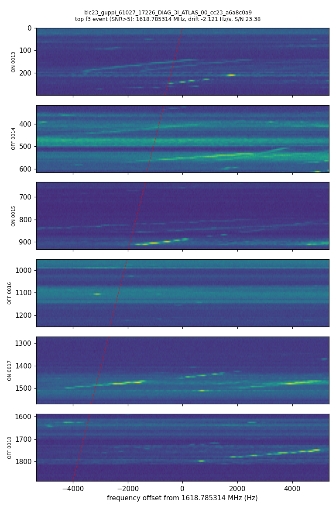

# SETI scan log (Breakthrough Listen open data)

Generated by `seti/scan.py` on 2026-10-06T01:52:20-07:00 (America/Phoenix). Queue: 1 done, 3 pending, 1 failed.

**Caveats (read these first).** Every hit and every "event" below is almost certainly radio-frequency interference (RFI) or noise. No detection is claimed. turboSETI hits are simply narrowband features above an S/N threshold, and the ON-OFF test only removes signals that also appear in the OFF pointings; a filter-3 event would still need checks against known RFI, a look at the waterfall, and above all re-observation at a later date before it means anything. The S/N 5 runs are deliberately below the usual BL threshold (10) and are dominated by noise fluctuations. These are tiny slices (one ~2.9 MHz coarse channel per file) of public data that BL has already searched; BL reported no technosignature in them.

## 3I/ATLAS GBT L-band (1618.65-1621.58 MHz, Iridium/GNSS region): blc23 scans 0013-0018, coarse channel 23

* Job id `blc23_guppi_61027_17226_DIAG_3I_ATLAS_00_cc23_a6a8c0a9`, kind `bl_h5_cadence`, coarse channel 23; run 2026-10-06T01:51:51-07:00 → 2026-10-06T01:51:57-07:00 (0.1 min); data pulled ≈ 912.2 MB.
* turboSETI FindDoppler: max |drift| 4.0 Hz/s, S/N thresholds 10.0, 5.0, DC bin blanked.

| file | role | source | MJD start | f_top (MHz) | channel width (Hz) | ints × tsamp (s) | URL |
|---|---|---|---|---|---|---|---|
| `blc23_guppi_61027_17226_DIAG_3I_ATLAS_0013.rawspec.0000.h5` | ON | DIAG_3I_ATLAS | 61027.19937 | 1621.582031 | 2.794 | 49 × 6.085 | https://bldata.berkeley.edu/ATLAS/GB_ATLAS/blc23_guppi_61027_17226_DIAG_3I_ATLAS_0013.rawspec.0000.h5 |
| `blc23_guppi_61027_17543_DIAG_3I_ATLAS_OFF_0014.rawspec.0000.h5` | OFF | DIAG_3I_ATLAS | 61027.20304 | 1621.582031 | 2.794 | 49 × 6.085 | https://bldata.berkeley.edu/ATLAS/GB_ATLAS/blc23_guppi_61027_17543_DIAG_3I_ATLAS_OFF_0014.rawspec.0000.h5 |
| `blc23_guppi_61027_17861_DIAG_3I_ATLAS_0015.rawspec.0000.h5` | ON | DIAG_3I_ATLAS | 61027.20672 | 1621.582031 | 2.794 | 49 × 6.085 | https://bldata.berkeley.edu/ATLAS/GB_ATLAS/blc23_guppi_61027_17861_DIAG_3I_ATLAS_0015.rawspec.0000.h5 |
| `blc23_guppi_61027_18179_DIAG_3I_ATLAS_OFF_0016.rawspec.0000.h5` | OFF | DIAG_3I_ATLAS | 61027.21041 | 1621.582031 | 2.794 | 49 × 6.085 | https://bldata.berkeley.edu/ATLAS/GB_ATLAS/blc23_guppi_61027_18179_DIAG_3I_ATLAS_OFF_0016.rawspec.0000.h5 |
| `blc23_guppi_61027_18497_DIAG_3I_ATLAS_0017.rawspec.0000.h5` | ON | DIAG_3I_ATLAS | 61027.21409 | 1621.582031 | 2.794 | 49 × 6.085 | https://bldata.berkeley.edu/ATLAS/GB_ATLAS/blc23_guppi_61027_18497_DIAG_3I_ATLAS_0017.rawspec.0000.h5 |
| `blc23_guppi_61027_18814_DIAG_3I_ATLAS_OFF_0018.rawspec.0000.h5` | OFF | DIAG_3I_ATLAS | 61027.21775 | 1621.582031 | 2.794 | 49 × 6.085 | https://bldata.berkeley.edu/ATLAS/GB_ATLAS/blc23_guppi_61027_18814_DIAG_3I_ATLAS_OFF_0018.rawspec.0000.h5 |

**S/N > 10:** 438 hits in total (ON 72; OFF 71; ON 59; OFF 84; ON 67; OFF 85).
ON-OFF filtering (turboSETI find_event_pipeline, zero-drift hits excluded): filter 1: 198 hits, filter 2: 164 hits, filter 3: 1 event(s) (3 ON hits) (filter 1 = S/N and drift cuts only; 2 = in at least one ON and no OFF; 3 = in all ONs and no OFF).

| top hits | frequency (MHz) | drift (Hz/s) | S/N | file |
|---|---|---|---|---|
| 1 (OFF) | 1621.360238 | 2.6531 | 176.21 | `blc23_guppi_61027_17543_DIAG_3I_ATLAS_OFF_0014.rawspec.0000.cc23.h5` |
| 2 (ON) | 1619.539605 | 0.8163 | 124.99 | `blc23_guppi_61027_18497_DIAG_3I_ATLAS_0017.rawspec.0000.cc23.h5` |
| 3 (OFF) | 1618.750982 | 0.7216 | 104.36 | `blc23_guppi_61027_17543_DIAG_3I_ATLAS_OFF_0014.rawspec.0000.cc23.h5` |
| 4 (ON) | 1619.176696 | 0.707 | 80.14 | `blc23_guppi_61027_17226_DIAG_3I_ATLAS_0013.rawspec.0000.cc23.h5` |
| 5 (OFF) | 1619.622175 | -2.9957 | 79.0 | `blc23_guppi_61027_18179_DIAG_3I_ATLAS_OFF_0016.rawspec.0000.cc23.h5` |

Filter-3 events (one row per event; the hits in the three ON scans):

| event | ON-hit frequencies (MHz) | ON-hit drifts (Hz/s) | ON-hit S/N |
|---|---|---|---|
| `DIAG_3I_ATLAS_35` | 1620.526451, 1620.527836, 1620.529158 | 3.1487, 1.4286, -2.0773 | 10.5, 11.83, 12.18 |

Strongest filter-2 hits (ON-only at this threshold): 1619.539605 MHz, 0.8163 Hz/s, S/N 124.99; 1619.176696 MHz, 0.707 Hz/s, S/N 80.14; 1619.785722 MHz, -3.3164 Hz/s, S/N 43.83.

**S/N > 5:** 828 hits in total (ON 139; OFF 157; ON 126; OFF 137; ON 122; OFF 147).
ON-OFF filtering (turboSETI find_event_pipeline, zero-drift hits excluded): filter 1: 387 hits, filter 2: 270 hits, filter 3: 1 event(s) (3 ON hits) (filter 1 = S/N and drift cuts only; 2 = in at least one ON and no OFF; 3 = in all ONs and no OFF).

| top hits | frequency (MHz) | drift (Hz/s) | S/N | file |
|---|---|---|---|---|
| 1 (OFF) | 1621.360238 | 2.6531 | 176.21 | `blc23_guppi_61027_17543_DIAG_3I_ATLAS_OFF_0014.rawspec.0000.cc23.h5` |
| 2 (ON) | 1619.539605 | 0.8163 | 124.99 | `blc23_guppi_61027_18497_DIAG_3I_ATLAS_0017.rawspec.0000.cc23.h5` |
| 3 (OFF) | 1618.750982 | 0.7216 | 104.36 | `blc23_guppi_61027_17543_DIAG_3I_ATLAS_OFF_0014.rawspec.0000.cc23.h5` |
| 4 (ON) | 1619.176696 | 0.707 | 80.14 | `blc23_guppi_61027_17226_DIAG_3I_ATLAS_0013.rawspec.0000.cc23.h5` |
| 5 (OFF) | 1619.622175 | -2.9957 | 79.0 | `blc23_guppi_61027_18179_DIAG_3I_ATLAS_OFF_0016.rawspec.0000.cc23.h5` |

Filter-3 events (one row per event; the hits in the three ON scans):

| event | ON-hit frequencies (MHz) | ON-hit drifts (Hz/s) | ON-hit S/N |
|---|---|---|---|
| `DIAG_3I_ATLAS_133` | 1618.787882, 1618.785314, 1618.784306 | -3.7318, -2.121, -2.9957 | 7.86, 23.38, 8.22 |

Strongest filter-2 hits (ON-only at this threshold): 1619.539605 MHz, 0.8163 Hz/s, S/N 124.99; 1619.176696 MHz, 0.707 Hz/s, S/N 80.14; 1619.785722 MHz, -3.3164 Hz/s, S/N 43.83.

Plot: top f3 event (SNR>5) — 1618.785314 MHz, drift -2.121 Hz/s, S/N 23.38. Red dashed line = fitted drift.

**Injection-recovery check (pipeline sanity test, synthetic signal).** A tone of 8.0 x the per-channel noise per integration, drifting at 0.37 Hz/s from 1620.703127 MHz, was added to the three ON scans only. Recovered as filter-3 event `DIAG_3I_ATLAS_28` with ON-hit drifts [0.379, 0.379, 0.379] Hz/s and S/N [26.07, 24.57, 26.63]. The injected copy produced 2 filter-3 event(s) in total at S/N > 10.

*Notes:* Search outputs were cached from the first pass (01:22-01:37 PT on 6 Oct 2026, ~15 min of turboSETI on a shared CPU); the runtime above is the cached re-run. A weaker injection test (3x per-channel noise per integration) was found in only one ON scan, at S/N 10.4 with the correct 0.379 Hz/s drift, so a tone of that strength sits right at the S/N-10 threshold. The filter-3 events shown here have inconsistent drift rates between the three ON scans (sign changes), and the waterfall shows similar drifting features in the OFF scans: typical RFI, most likely from satellite downlinks in this band (Iridium operates at 1616-1626.5 MHz), although the specific transmitter was not identified.

## Failed jobs

* `voyager_f1032192_t300_v2_418d012f`: public Voyager-1 file reachable from this box (storage.googleapis.com/gbt_fil/voyager_f1032192_t300_v2.fil, 504 MB) has only 2 time integrations, too few for a drift search (blimpy/turboSETI need >=3); the 16-integration tutorial file Voyager1.single_coarse.fine_res.h5 on blpd0.ssl.berkeley.edu timed out (host unreachable from this network)

## Pending queue

* `blc24_guppi_61027_17226_DIAG_3I_ATLAS_00_cc27_3dae93af` (bl_h5_cadence, coarse channel 27): 3I/ATLAS GBT L-band (1419.43-1422.36 MHz, includes HI 1420.41 MHz): blc24 scans 0013-0018, coarse channel 27
* `blc21_guppi_61027_17226_DIAG_3I_ATLAS_00_cc18_d2c0ccee` (bl_h5_cadence, coarse channel 18): 3I/ATLAS GBT (2008.30-2011.23 MHz, strong line seen in mid-res bandpass): blc21 scans 0013-0018, coarse channel 18
* `blc20_guppi_61027_31308_DIAG_3I_ATLAS_00_cc34_b61007ca` (bl_h5_cadence, coarse channel 34): 3I/ATLAS GBT X-band node (12273.93-12276.86 MHz): blc20 scans 0061-0066, coarse channel 34

## How the queue works

`seti/queue.json` lists jobs with `status` pending / done / failed. `python scan.py` takes the next pending job(s) (`--max-jobs`), pulls the data (one coarse channel per remote BL HDF5 file via HTTP range requests, or a whole small file), runs turboSETI at each S/N threshold, applies ON-OFF cadence filtering when the job is a cadence, plots the top hit, stores results in the job, marks it done and rebuilds this log. Add work with `scan.py add-cadence`, `scan.py add-file` or `scan.py seed-index <BL directory URL> --coarse a,b`. A weekly cron line such as `0 9 * * 1 cd /workspace/drake/seti && .venv/bin/python scan.py --max-jobs 1` keeps it moving.

